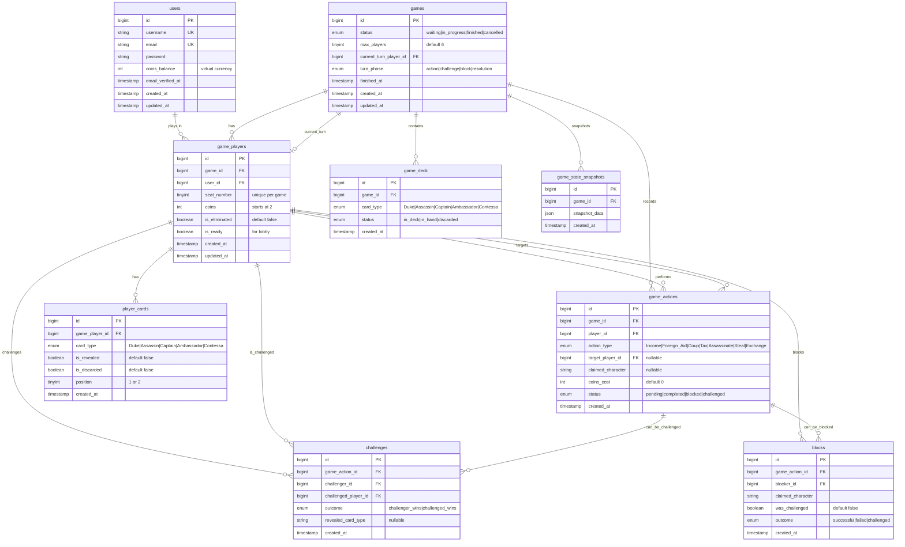

# Coup Game - Database Architecture

## Table of Contents
- [Overview](#overview)
- [Entity Relationship Diagram](#entity-relationship-diagram)
- [Table Descriptions](#table-descriptions)
- [Design Rationale](#design-rationale)
- [Key Relationships](#key-relationships)

---

## Overview

This database is designed for a **Coup card game** application. Coup is a bluffing card game where players use character abilities (Duke, Assassin, Captain, Ambassador, Contessa) to eliminate opponents and be the last player standing.

The database architecture separates concerns into logical layers:
- **Authentication Layer**: User accounts and sessions
- **Game State Layer**: Active games and their configurations
- **Player Participation Layer**: Junction between users and games with game-specific state
- **Game Content Layer**: Cards in hands and deck
- **Action Layer**: Player actions, challenges, and blocks
- **History Layer**: Game state snapshots for replay/recovery

---

## Entity Relationship Diagram

> **📌 To view the interactive diagram below:**
> 1. Press **`Ctrl+Shift+V`** (or click the preview icon in the top right) to open Markdown Preview
> 2. Install the **"Markdown Preview Mermaid Support"** extension if the diagram doesn't appear
> 3. The diagram will render with boxes and connecting lines showing all relationships



---

## Table Descriptions

### Core Tables

#### **users**
Stores player account information.
- `coins_balance`: Virtual currency for buying into games (separate from in-game coins)
- `username` and `email`: Both unique identifiers
- Authentication fields: `password`, `remember_token`, `email_verified_at`

#### **games**
Represents a game instance.
- `status`: Tracks game lifecycle (waiting for players → in progress → finished/cancelled)
- `max_players`: Configurable (default 6, Coup supports 2-6 players)
- `current_turn_player_id`: Points to the active player's turn
- `turn_phase`: Tracks sub-phases within a turn (action → potential challenge → potential block → resolution)

#### **game_players** (Junction Table)
Links users to games with game-specific data.
- `seat_number`: Physical position at table (1-6), unique per game
- `coins`: In-game currency (starts at 2, accumulates during play)
- `is_eliminated`: Tracked when both influence cards are lost
- `is_ready`: Used in lobby before game starts
- **Unique constraints**: 
  - One user cannot join same game twice
  - One seat per player in a game

---

### Game Content Tables

#### **player_cards**
Individual cards in each player's hand (influence).
- Each player has exactly 2 cards (their "influence")
- `position`: Distinguishes between card 1 and card 2
- `is_revealed`: True when challenged or voluntarily shown
- `is_discarded`: True when card is lost (revealed due to challenge or coup)
- **Why separate rows?**: Allows atomic operations on individual cards

#### **game_deck**
Tracks all cards not in player hands.
- Initialized with 15 cards (3 of each character type)
- `status` tracks lifecycle:
  - `in_deck`: Available for drawing
  - `in_hand`: Currently dealt to players (tracked separately in player_cards)
  - `discarded`: Out of play
- **Critical for**: Ambassador exchange action (swap cards with deck)

---

### Action Layer Tables

#### **game_actions**
Records every action taken in a game.
- `action_type`: 
  - General: Income (+1 coin), Foreign Aid (+2 coins), Coup (7 coins, eliminate player)
  - Character-specific: Tax (Duke), Assassinate (Assassin), Steal (Captain), Exchange (Ambassador)
- `claimed_character`: When using character ability (can be a bluff!)
- `target_player_id`: For targeted actions (Coup, Assassinate, Steal)
- `status`: 
  - `pending`: Action declared, awaiting challenges/blocks
  - `completed`: Action successfully executed
  - `blocked`: Another player blocked it
  - `challenged`: Someone challenged the claim

#### **challenges**
Records challenge attempts on actions or blocks.
- `challenger_id`: Who initiated the challenge
- `challenged_player_id`: Who is being challenged
- `outcome`: 
  - `challenger_wins`: Challenged player couldn't prove claim (loses influence)
  - `challenged_wins`: Player proved claim (challenger loses influence)
- `revealed_card_type`: The card shown to prove the claim
- **Game rule**: Challenge says "I don't believe you have that character"

#### **blocks**
Records block attempts on actions.
- `blocker_id`: Player attempting to block
- `claimed_character`: Character used to block (e.g., Contessa blocks Assassinate)
- `was_challenged`: True if someone challenged the block claim
- `outcome`: Success, failure, or challenged
- **Blocks can be challenged too**: Creates a challenge record linked to the block

---

### History Table

#### **game_state_snapshots**
JSON snapshots of complete game state at points in time.
- Used for:
  - Game replay/review
  - Recovery from errors
  - Debugging
  - Analytics
- `snapshot_data`: Complete JSON representation of game state

---

## Design Rationale

### 1. **Why Separate `game_players` from `users`?**

**Alternative**: Directly link `games` and `users` with a simple many-to-many table.

**Why This Is Better**:
- **Game-specific state**: `coins`, `seat_number`, `is_eliminated`, `is_ready` belong to this game instance only
- **User account separation**: User's `coins_balance` (account currency) is different from in-game `coins`
- **Multiple simultaneous games**: Same user can play in multiple games with different states
- **Historical data**: When game ends, game_players records remain intact even if user is deleted

**Example**: User "Alice" has 1000 coins in her account, but in Game #5 she has 7 coins and is at seat 3, while in Game #12 she has 4 coins and is at seat 1.

---

### 2. **Why `player_cards` in Separate Table?**

**Alternative**: Store cards as JSON array in `game_players.cards`.

**Why This Is Better**:
- **Atomic operations**: Can reveal/discard individual cards without parsing JSON
- **Queryability**: 
  ```sql
  -- Find all players with Duke
  SELECT * FROM player_cards WHERE card_type = 'Duke' AND is_revealed = false
  ```
- **Position tracking**: Explicitly track "left card" vs "right card" (position 1 vs 2)
- **Transaction safety**: Database constraints prevent invalid states
- **Indexing**: Can create indexes on card_type, game_player_id, etc.

**Example Scenario**: Player claims Duke (Tax action). If challenged and loses, they must reveal the card. With separate rows, you can:
```sql
UPDATE player_cards 
SET is_revealed = true, is_discarded = true 
WHERE id = 47
```
Clean, atomic, and creates an audit trail.

---

### 3. **Why Separate `game_deck` Table?**

**Alternative**: Only track cards in players' hands.

**Why This Is Better**:
- **Card lifecycle management**: Tracks all 15 cards from initialization through discard
- **Ambassador action**: Exchange cards requires knowing what's in the deck
  - Player looks at 2 cards from deck, can swap with their hand
  - Requires actual deck state, not just player states
- **Game initialization**: Clear record of deck creation (3 × 5 character types)
- **Discard pile**: Tracks publicly known discarded cards
- **Anti-cheat**: Server authoritative on deck contents

**Card Flow**:
```
game_deck (status: in_deck) 
  → deal to player → 
game_deck (status: in_hand) + player_cards created
  → card revealed → 
game_deck (status: discarded) + player_cards (is_discarded: true)
```

---

### 4. **Why `game_actions` with Status Field?**

**Alternative**: Just log completed actions.

**Why This Is Better**:
- **Multi-phase resolution**: Actions aren't instant in Coup
  1. Player declares action (status: `pending`)
  2. Others can challenge (status: `challenged`)
  3. Others can block (status: `pending` still)
  4. Block can be challenged
  5. Finally resolves (status: `completed` or `blocked`)
- **Game state management**: Know what action is currently being resolved
- **Rollback capability**: If challenge succeeds, action can be cancelled
- **Client synchronization**: Clients know when to show "Challenge?" UI

**Example Flow**:
```
Player A: "I'm using Duke to Tax (+3 coins)" 
  → game_actions created (status: pending, claimed_character: 'Duke')
Player B: "I challenge that!"
  → challenges created
  → IF Player A shows Duke: challenge.outcome = 'challenged_wins', 
                            action.status = 'completed'
  → IF Player A can't show Duke: challenge.outcome = 'challenger_wins',
                                 action.status = 'challenged'
```

---

### 5. **Why Separate `challenges` and `blocks` Tables?**

**Alternative**: Add `challenged_by` and `blocked_by` fields to `game_actions`.

**Why This Is Better**:
- **Multiple responses possible**: Multiple players could try to block/challenge (depending on house rules)
- **Rich data**: Captures WHO challenged, WHAT was revealed, WHEN it happened
- **Blocks can be challenged**: Block is itself a claim that can be challenged
  - `blocks` table has `was_challenged` field
  - Challenge of a block creates a `challenges` record
- **Historical accuracy**: Complete record of all challenge/block attempts
- **Game replay**: Can reconstruct exact sequence of events

**Complex Scenario**:
```
Player A: "I'll Assassinate Player B" (claims Assassin)
  → game_actions created
Player B: "I block with Contessa"
  → blocks created (claimed_character: 'Contessa')
Player C: "I challenge your Contessa!"
  → challenges created (challenging the block, not the original action)
```

This creates:
- 1 game_action record
- 1 block record (links to game_action)
- 1 challenge record (links to game_action, but challenges Player B's block claim)

---

### 6. **Why `game_state_snapshots` with JSON?**

**Alternative**: Rely on relational data to reconstruct state.

**Why This Is Better**:
- **Point-in-time recovery**: Exact state at any moment
- **Performance**: Fast retrieval without complex joins
- **Flexibility**: Can store arbitrary metadata (game settings, UI state, player chat)
- **Debugging**: When bug reports come in, you have exact state
- **Analytics**: Can analyze complete game states for balance/statistics
- **Denormalized data is OK here**: This is append-only historical data

**Use Cases**:
- "Show me the board state when this bug occurred"
- "Replay game from turn 5"
- "Generate highlight reel of game"
- "Analytics: What was coin distribution when player X won?"

---

## Key Relationships

### Circular Dependency: `games` ↔ `game_players`
```
games.current_turn_player_id → game_players.id
game_players.game_id → games.id
```

**Why?**: Game needs to know whose turn it is, and that player must be IN that game.

**Solution**: 
1. Create `games` table first (no foreign key constraint yet)
2. Create `game_players` table with FK to games
3. Add FK constraint from games to game_players (last migration)

**Implementation**: See `2026_01_20_200012_add_foreign_key_to_games_current_turn_player_id.php`

---

### Cascade Deletes

**games → ON DELETE CASCADE to**:
- `game_players`: Players removed if game deleted
- `game_deck`: Deck destroyed if game deleted
- `game_actions`: All actions erased if game deleted
- `game_state_snapshots`: History removed if game deleted

**game_players → ON DELETE CASCADE to**:
- `player_cards`: Cards removed if player removed from game

**game_actions → ON DELETE CASCADE to**:
- `challenges`: Challenges removed if action deleted
- `blocks`: Blocks removed if action deleted

**Rationale**: Game data is inherently linked. If a game is deleted (e.g., abandoned game cleanup), all related data should be removed to maintain referential integrity.

---

### Unique Constraints

**game_players**:
- `unique(game_id, user_id)`: User can't join same game twice
- `unique(game_id, seat_number)`: Two players can't sit in same seat

**Purpose**: Data integrity at database level, not just application level.

---

## Design Principles Applied

1. **Normalization**: 
   - No redundant data (except snapshots, which are intentionally denormalized)
   - Each piece of data stored once

2. **Separation of Concerns**:
   - User accounts separate from game participation
   - Game state separate from action history

3. **Audit Trail**:
   - Every action recorded with timestamp
   - Immutable history (mostly append-only)

4. **Flexibility**:
   - Enum types for known values (prevents typos)
   - JSON for variable/future data (snapshots)

5. **Performance**:
   - Indexes on foreign keys
   - Composite indexes on frequently queried combinations

6. **Data Integrity**:
   - Foreign key constraints
   - Unique constraints
   - NOT NULL where appropriate
   - Cascade deletes for dependent data

---

## Example Queries

### Get current game state for a player:
```sql
SELECT g.*, gp.coins, gp.seat_number, gp.is_eliminated
FROM games g
JOIN game_players gp ON g.id = gp.game_id
WHERE gp.user_id = ? AND g.status = 'in_progress';
```

### Get player's cards:
```sql
SELECT card_type, is_revealed, position
FROM player_cards pc
JOIN game_players gp ON pc.game_player_id = gp.id
WHERE gp.user_id = ? AND gp.game_id = ?
ORDER BY position;
```

### Get all actions in current turn:
```sql
SELECT ga.*, u.username as player_name
FROM game_actions ga
JOIN game_players gp ON ga.player_id = gp.id
JOIN users u ON gp.user_id = u.id
WHERE ga.game_id = ?
ORDER BY ga.created_at DESC
LIMIT 10;
```

### Check if action was challenged:
```sql
SELECT c.*, u.username as challenger_name
FROM challenges c
JOIN game_players gp ON c.challenger_id = gp.id
JOIN users u ON gp.user_id = u.id
WHERE c.game_action_id = ?;
```

---

## Future Considerations

### Potential Enhancements:

1. **game_chat**: Store in-game chat messages
2. **game_invitations**: Formalize player invitations
3. **tournaments**: Multi-game tournament structure
4. **statistics**: Aggregate player statistics
5. **replays**: Enhanced replay data with UI states
6. **ai_players**: Bot players for solo practice

### Scalability:

- **Partitioning**: Partition `game_actions`, `challenges`, `blocks` by `game_id` for large installations
- **Archiving**: Move finished games to archive tables after 30 days
- **Caching**: Redis for active game states (with snapshots as backup)
- **Read Replicas**: Separate read queries (game history, stats) from write queries (game actions)

---

## Conclusion

This database architecture prioritizes:
- ✅ **Data Integrity**: Foreign keys, constraints, and normalization
- ✅ **Auditability**: Complete action history with timestamps
- ✅ **Flexibility**: Can handle complex game scenarios
- ✅ **Performance**: Indexed for common queries
- ✅ **Maintainability**: Clear relationships and separation of concerns

The structure may seem complex, but it accurately models the intricate game mechanics of Coup where actions can be challenged, blocked, and the blocks themselves can be challenged. This complexity in the database enables clean, simple application code.
