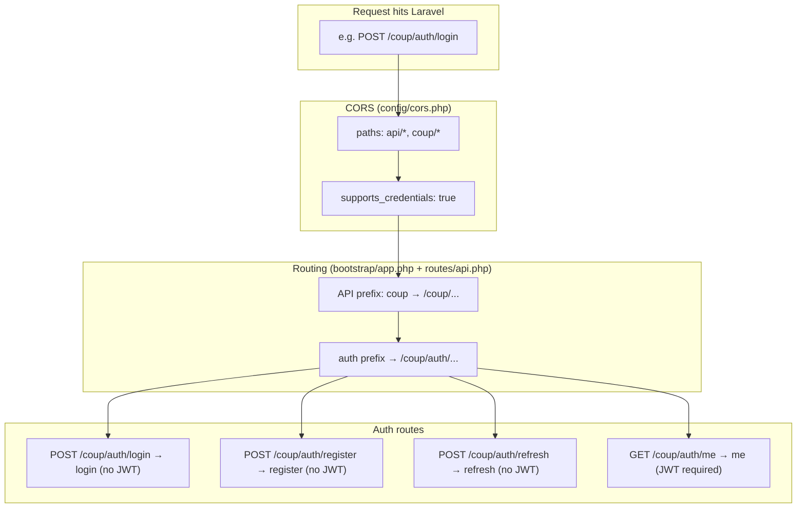
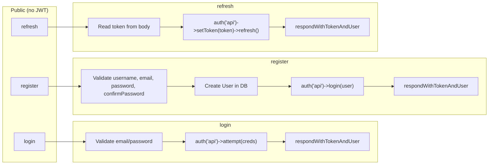
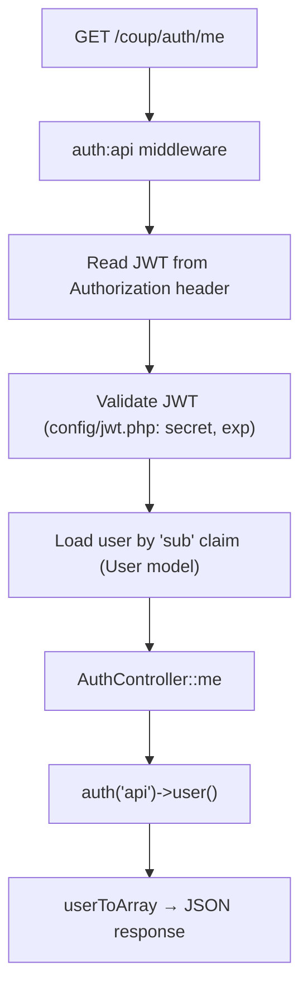
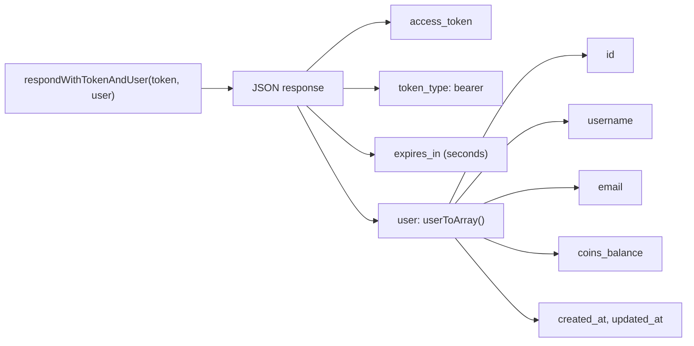

# Backend Auth Flow (JWT)

A frontend-oriented guide to how the Laravel backend handles login, register, refresh, and protected routes.

---

## 1. Request lifecycle (high level)



---

## 2. Auth endpoints flow



---

## 3. Protected route: GET /coup/auth/me



---

## 4. Response shape (token + user)

All successful login, register, and refresh responses use the same helper:



---

## 5. Frontend ↔ backend sequence

```mermaid
sequenceDiagram
    participant FE as Frontend
    participant API as Backend (Laravel)

    Note over FE,API: Login
    FE->>API: POST /coup/auth/login { email, password }
    API->>API: Validate → auth('api')->attempt()
    API->>API: Build JWT (jwt.php + User::getJWTIdentifier)
    API->>FE: { access_token, token_type, expires_in, user }
    FE->>FE: Store token, set user in auth context

    Note over FE,API: Authenticated request
    FE->>API: GET /coup/auth/me<br/>Header: Authorization: Bearer &lt;token&gt;
    API->>API: auth:api middleware (decode JWT, load user)
    API->>API: AuthController::me → userToArray
    API->>FE: { id, username, email, coins_balance, ... }

    Note over FE,API: Token refresh
    FE->>API: POST /coup/auth/refresh { token: currentToken }
    API->>API: setToken → refresh (within refresh_ttl)
    API->>FE: { access_token, user, ... }
    FE->>FE: Replace stored token
```

---

## 6. How the pieces map to the frontend

### Routing and URL shape

- **`bootstrap/app.php`**  
  Sets `apiPrefix: 'coup'`, so all API routes live under `/coup/...`. Your frontend should call e.g. `POST /coup/auth/login`, not `/api/auth/login` (unless you have a proxy that rewrites).

- **`routes/api.php`**  
  Defines the auth endpoints under the `auth` prefix:

| Route | Method | Frontend use | Auth required? |
|-------|--------|--------------|----------------|
| `/coup/auth/login` | POST | Login with email/password | No |
| `/coup/auth/register` | POST | Sign up | No |
| `/coup/auth/refresh` | POST | Refresh token (body: `{ token }`) | No |
| `/coup/auth/me` | GET | Get current user | Yes (JWT) |

So login, register, and refresh are "public"; `me` is protected and expects a valid JWT.

---

### CORS

- **`config/cors.php`**  
  Ensures the browser allows your frontend origin to call `api/*` and `coup/*`, send credentials (e.g. `Authorization` header), and use the methods/headers you need. So when your frontend does `fetch(API_URL + '/coup/auth/login', { headers: { Authorization: 'Bearer ' + token } })`, CORS is already handled here.

---

### Who checks the JWT? (auth guard + middleware)

- **`config/auth.php`**  
  Defines the `api` guard with `driver` => `jwt` and `provider` => `users`. So "auth for API" = "validate JWT and load user from `users` provider".

- **`AuthController::__construct()`**  
  `$this->middleware('auth:api', ['except' => ['login', 'register', 'refresh']]);`  
  So `login`, `register`, and `refresh` run without any JWT. Only `me` runs after the `auth:api` middleware. That middleware reads the JWT (usually from `Authorization: Bearer <token>`), uses **config/jwt.php** (secret, TTL, algorithm, etc.) to validate and decode it, and puts the authenticated user on `auth('api')->user()`.

So the flow for protected routes is: **Request → CORS → Route → auth:api middleware (JWT check) → AuthController::me**.

---

### How the token is created and what's in it

- **`config/jwt.php`**  
  - `secret` (or keys) used to sign the token.  
  - `ttl` = access token lifetime (e.g. 60 minutes).  
  - `refresh_ttl` = how long the original token can be used to get a new one (e.g. 2 weeks).  
  So "login/register" produce a token that expires in `ttl`; "refresh" is allowed until `refresh_ttl`.

- **`User` model**  
  Implements `JWTSubject`.  
  - `getJWTIdentifier()`: value that goes in the JWT "sub" claim (here, the user `id`).  
  - `getJWTCustomClaims()`: extra payload (here, none).  
  So when the backend does `auth('api')->login($user)` or `auth('api')->refresh()`, it builds a JWT whose "sub" is the user id; the middleware later uses that to load the same user for `me`.

---

### AuthController methods (mapped to frontend)

- **login**  
  Validates `email` + `password`. Calls `auth('api')->attempt($credentials)`. If it matches a user, Laravel hashes the password and compares; on success it generates a JWT and returns it + user. Same shape as your frontend expects: `access_token`, `user`, etc.

- **register**  
  Validates `username`, `email`, `password`, `confirmPassword`. Creates a `User` (password is hashed via `Hash::make`). Then `auth('api')->login($user)` issues a JWT and returns token + user. Again, this matches what the frontend stores and uses.

- **refresh**  
  Expects the current (possibly expired) token in the body, e.g. `{ token: "..." }`. It does `auth('api')->setToken($token)->refresh()`. The JWT library checks the token (e.g. still within `refresh_ttl`), issues a new token, and optionally blacklists the old one (per `config/jwt.php`). Response is again token + user. Your frontend then replaces the stored token with the new one.

- **me**  
  Only runs after `auth:api` middleware. So when the frontend sends `Authorization: Bearer <token>`, the backend validates the JWT, loads the user by `sub`, and returns `userToArray($user)`. No password or sensitive fields (those are in `User::$hidden`).

---

## 7. Summary

- **CORS** lets the browser talk to the API.
- **Routes** map URLs to **AuthController** (`/coup/auth/*`).
- **auth.php** says "api = JWT".
- **jwt.php** configures token lifetime and signing.
- **User** provides the JWT "sub" (user id).
- **Middleware** protects `me`; **login/register** issue the first token, **refresh** issues a new one, **me** returns the user for the current token.

That's the backend flow your frontend auth talks to.
