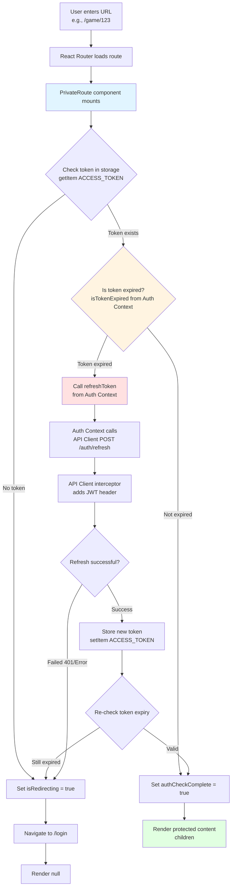
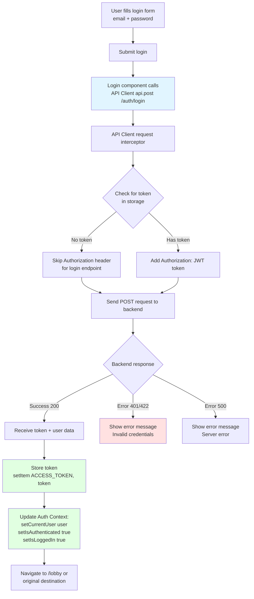
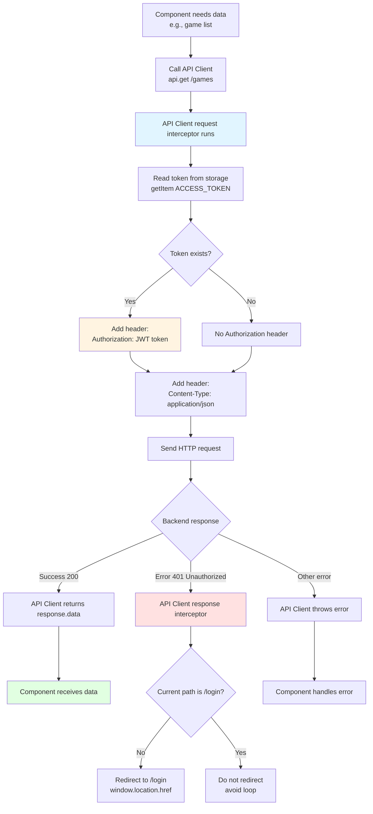
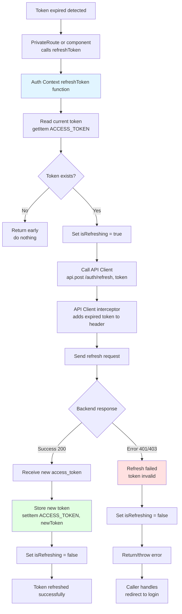
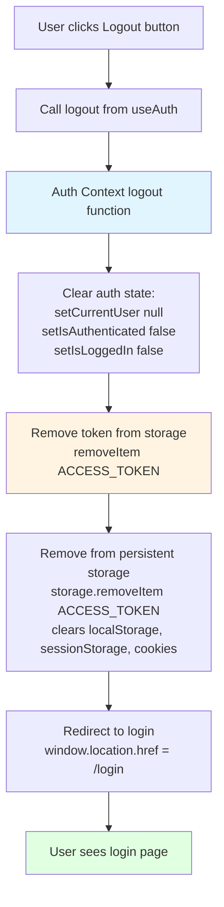
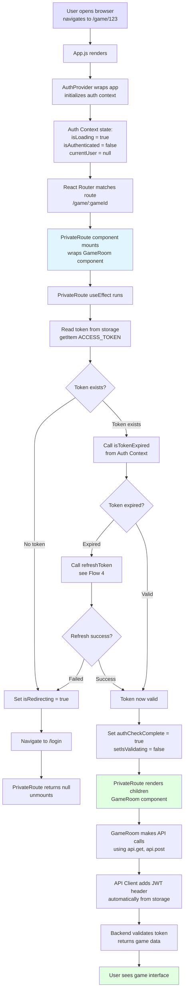
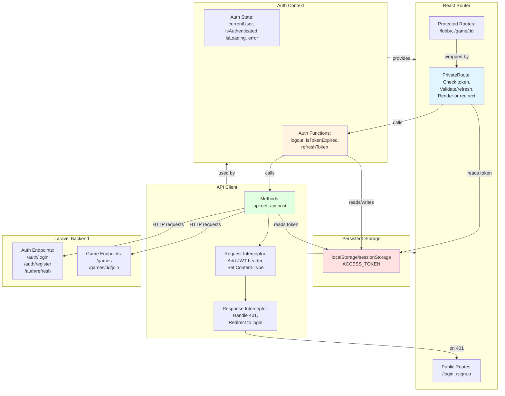

# Authentication Flow - Coup Frontend

This document visualizes the authentication flow and how different components interact in the Coup frontend application.

## Components Overview

- **API Client** (`api/client.ts`) - Handles all HTTP requests with automatic token injection
- **Auth Context** (`contexts/auth-context.tsx`) - Manages auth state and provides auth functions
- **Private Route** (`src/components/auth/PrivateRoute.tsx`) - Protects routes that require authentication
- **Persistent Storage** (`utils/persistentStorage.ts`) - Handles token storage (localStorage/sessionStorage)

---

## Flow 1: User Enters Website URL (Protected Route)



---

## Flow 2: User Tries to Login



---

## Flow 3: API Request to Protected Endpoint



---

## Flow 4: Token Refresh Process



---

## Flow 5: User Logs Out



---

## Flow 6: Complete Initial Load to Protected Content



---

## Component Interaction Diagram



---

## Key Points

### 1. **Token Storage**
- Tokens are stored in `localStorage` and `sessionStorage` via `persistentStorage.ts`
- Key: `StorageKey.ACCESS_TOKEN` (value: `"access_token"`)

### 2. **API Client Interceptors**
- **Request Interceptor**: Automatically adds `Authorization: JWT {token}` header to every request
- **Response Interceptor**: Catches 401 errors and redirects to `/login` (except when already on login page)

### 3. **Auth Context Responsibilities**
- Manages authentication state (`isAuthenticated`, `currentUser`, `isLoading`)
- Provides utility functions (`isTokenExpired`, `refreshToken`, `logout`)
- Does NOT automatically hydrate auth state on app load (relies on token in storage)

### 4. **PrivateRoute Logic**
- Token-based authentication check (doesn't depend on `isAuthenticated` from context)
- Reads token directly from storage
- Validates token expiry using `isTokenExpired()` from Auth Context
- Attempts token refresh if expired
- Redirects to `/login` if no token or refresh fails
- Shows loading spinner during validation
- Renders protected content when token is valid

### 5. **Token Refresh Strategy**
- PrivateRoute checks token on route entry
- If expired, calls `refreshToken()` from Auth Context
- Auth Context sends old token to backend `/auth/refresh`
- Backend returns new token (if old token is valid for refresh)
- New token is stored and route allows access

### 6. **Logout Process**
- Clears all auth state in Auth Context
- Removes token from all storage locations (localStorage, sessionStorage, cookies)
- Hard redirects to `/login` using `window.location.href`

---

## File Dependencies

```
┌─────────────────────────────────────────────────────────┐
│                   App Entry Point                        │
│                   src/index.js                           │
│              (wraps app with AuthProvider)               │
└────────────────────┬────────────────────────────────────┘
                     │
        ┌────────────┴────────────┐
        │                         │
        ▼                         ▼
┌───────────────┐         ┌──────────────────┐
│  Auth Context │◄────────│  Private Route   │
│               │ provides│                  │
│ - state       │  auth   │ - checks token   │
│ - functions   │ funcs   │ - validates      │
└───────┬───────┘         └─────────┬────────┘
        │                           │
        │ uses                      │ uses
        │                           │
        ▼                           ▼
┌───────────────────────────────────────────┐
│            API Client                     │
│                                           │
│ - request interceptor (add JWT)          │
│ - response interceptor (handle 401)      │
│ - methods: get(), post()                 │
└──────────────┬────────────────────────────┘
               │
               │ reads/writes
               │
               ▼
┌──────────────────────────────────────────┐
│      Persistent Storage Utils            │
│                                          │
│ - getItem(ACCESS_TOKEN)                 │
│ - setItem(ACCESS_TOKEN, token)          │
│ - removeItem(ACCESS_TOKEN)              │
└──────────────────────────────────────────┘
```

---

## Environment Variables

```env
# .env or .env.local
REACT_APP_API_URL=http://localhost:8000/coup
```

- API Client uses this to construct base URL
- Default: `http://localhost:8000/coup`

---

## Next Steps

1. **Create Login/Signup Pages** - Forms that call API Client with credentials
2. **Implement Router** - Set up React Router with public and private routes
3. **Add Auth Initialization** - Optionally add logic to Auth Context to restore auth state on app load
4. **Build Protected Pages** - Game lobby, game room, profile, etc.
5. **Handle Token Expiry** - Add automatic token refresh on API 401 responses (in addition to route guards)
