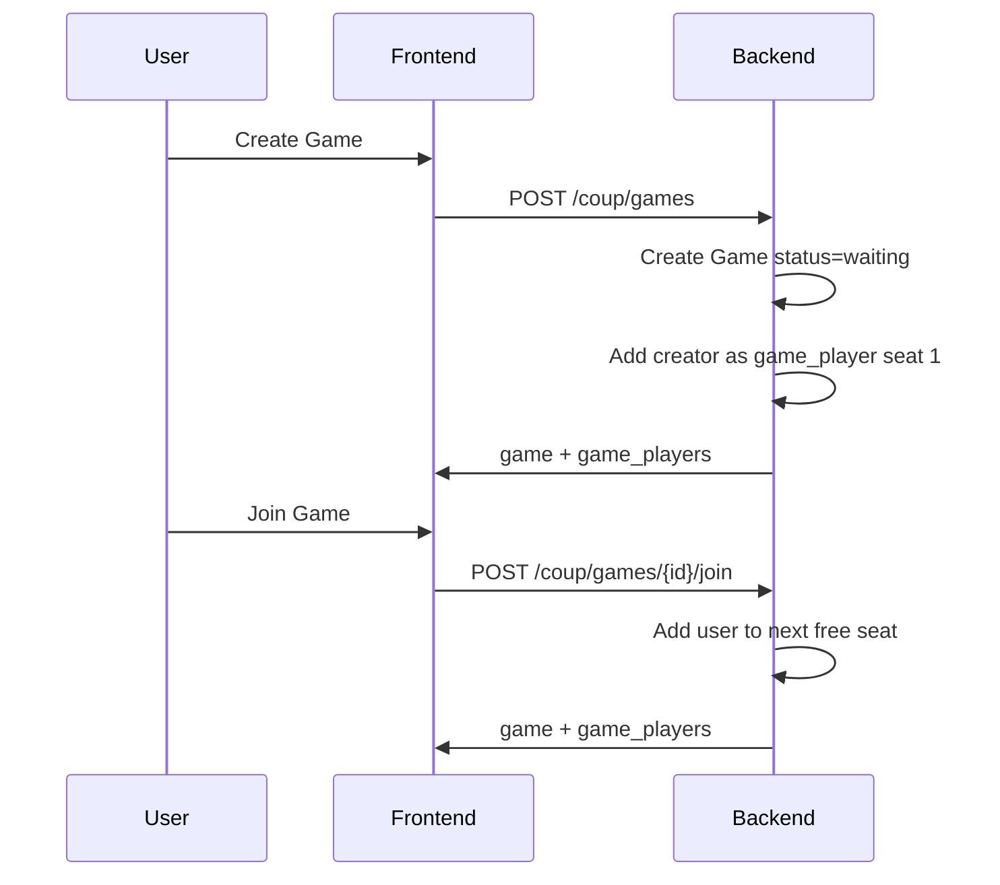

# Coup Game Implementation Plan

A phased implementation roadmap for the Coup card game, from auth through lobby creation/joining to full gameplay with actions, challenges, blocks, and win conditions. The next immediate step is create and join lobby.

---

## Current State (What's Done)

| Component       | Status     | Location                                                                                   |
| --------------- | ---------- | ------------------------------------------------------------------------------------------ |
| Database schema | Done       | [backend/DATABASE_ARCHITECTURE.md](../backend/DATABASE_ARCHITECTURE.md), migrations        |
| Eloquent models | Done       | `Game`, `GamePlayer`, `User`, `PlayerCard`, `GameDeck`, `GameAction`, `Challenge`, `Block` |
| Auth flow       | Documented | [AUTH_FLOW.md](./AUTH_FLOW.md)                                                             |
| Frontend        | Boilerplate| Default React app; auth UI and routing not yet integrated                                  |

---

## Implementation Phases

```mermaid
flowchart LR
    subgraph done [Done]
        A1[DB Design]
        A2[Models]
    end

    subgraph phase1 [Phase 1]
        B1[Auth API]
        B2[Auth Frontend]
    end

    subgraph phase2 [Phase 2]
        C1[Create Lobby]
        C2[Join Lobby]
        C3[Lobby UI]
    end

    subgraph phase3 [Phase 3]
        D1[Ready / Start]
        D2[Deal Cards]
    end

    subgraph phase4 [Phase 4]
        E1[Actions]
        E2[Challenges]
        E3[Blocks]
        E4[Resolution]
    end

    A1 --> A2 --> B1 --> B2 --> C1 --> C2 --> C3 --> D1 --> D2 --> E1 --> E2 --> E3 --> E4
```



---

## Phase 1: Auth (if not wired)

- **Backend**: Add API routes (`/coup/auth/*`), `AuthController`, JWT middleware. See [AUTH_FLOW.md](./AUTH_FLOW.md).
- **Frontend**: Login/Signup pages, auth context, private routes, token storage, API client.

---

## Phase 2: Create and Join Lobby (next step)

Core API and UI for lobbies.

### 2a. Backend

- **Routes** (require JWT):
  - `POST /coup/games` — create game (status: `waiting`, creator joins as player 1, seat 1).
  - `GET /coup/games` — list games (filter: `status=waiting`, optionally paginated).
  - `POST /coup/games/{id}/join` — join game (next free seat, add `game_players` row).
- **Controller**: `GameController` (or `LobbyController`).
- **Validation**: max players, no duplicate join, game must be `waiting`.

### 2b. Frontend

- **Pages**: Lobby list, Create game, Lobby room (shows players, seats).
- **Components**: Game card, player list, Create/Join buttons.
- **API**: `createGame()`, `listGames()`, `joinGame()`.

### 2c. Data flow



---

## Phase 3: Lobby Ready and Game Start

- **Ready**: `PATCH /coup/games/{id}/players/me/ready` to toggle `is_ready`.
- **Start** (host only, or all ready):
  - `POST /coup/games/{id}/start`
  - Set `status` → `in_progress`
  - Initialize `game_deck` (15 cards: 3× Duke, Assassin, Captain, Ambassador, Contessa)
  - Deal 2 cards per player → `player_cards` + update `game_deck.status`
  - Set `current_turn_player_id` to first player, `turn_phase` → `action`
- **Validation**: min 2 players, creator or all-ready rule.

---

## Phase 4: Game Loop (Action → Challenge → Block → Resolution)

Per-turn flow:

1. **Action phase**: Active player declares action.
   - `POST /coup/games/{id}/actions`
   - Body: `action_type`, `claimed_character` (if applicable), `target_player_id` (if applicable).
   - Creates `game_actions` row, status `pending`.
2. **Challenge phase**: Others may challenge.
   - `POST /coup/games/{id}/actions/{actionId}/challenge`
   - Resolve challenge: reveal card or lose influence.
   - Update `challenges`, `player_cards`, `game_actions.status`.
3. **Block phase**: Others may block (where applicable).
   - `POST /coup/games/{id}/actions/{actionId}/block`
   - Body: `claimed_character`.
   - Block can be challenged (same challenge flow).
4. **Resolution phase**:
   - Execute action: update coins, discard cards, etc.
   - Set `game_actions.status` → `completed` or `blocked`.
   - Advance turn: `current_turn_player_id` → next active player, `turn_phase` → `action`.

### Action types (reference)

| Action      | Claimed    | Blockable by       | Cost |
| ----------- | ---------- | ------------------ | ---- |
| Income      | —          | —                  | —    |
| Foreign Aid | —          | Duke               | —    |
| Tax         | Duke       | —                  | —    |
| Assassinate | Assassin   | Contessa           | 3    |
| Steal       | Captain    | Captain/Ambassador | —    |
| Exchange    | Ambassador | —                  | —    |
| Coup        | —          | —                  | 7    |

---

## Phase 5: Win Condition and Game End

- **Win**: Single active player left (`is_eliminated = false`).
- **End**: Set `games.status` → `finished`, `finished_at` = now.
- **API**: `GET /coup/games/{id}` returns full state; client derives winner from `game_players`.

---

## Phase 6: Real-Time Updates (recommended)

- **WebSockets** (e.g. Laravel Reverb + Echo) or **polling** for lobby and in-game state.
- Events: `PlayerJoined`, `PlayerReady`, `GameStarted`, `ActionDeclared`, `Challenge`, `Block`, `Resolution`, `GameEnded`.
- Frontend: subscribe to game channel and update UI on events.

---

## Phase 7: Polish

- Game history / replays (use `game_state_snapshots`).
- In-game chat (new table if needed).
- UI: card art, animations, responsive layout.
- Reconnection and token refresh.

---

## Summary: All Steps in Order

1. Auth API + frontend (if missing)
2. **Create lobby** — `POST /coup/games`
3. **List lobbies** — `GET /coup/games?status=waiting`
4. **Join lobby** — `POST /coup/games/{id}/join`
5. Lobby UI (list, create, join, room view)
6. Ready toggle — `PATCH .../players/me/ready`
7. Start game — `POST /coup/games/{id}/start` (init deck, deal cards)
8. Action API — declare action
9. Challenge API — challenge action/block
10. Block API — block action
11. Resolution logic — execute action, advance turn
12. Win detection and game end
13. Real-time updates
14. Polish (UI, history, chat, etc.)

The next concrete step is Phase 2: Create and Join Lobby (backend routes + controller + frontend pages).

---

## Target Folder Structure (End State)

### Backend (Laravel)

```
backend/
├── app/
│   ├── Http/
│   │   ├── Controllers/
│   │   │   ├── Api/
│   │   │   │   ├── AuthController.php
│   │   │   │   └── GameController.php
│   │   │   └── Controller.php
│   │   ├── Middleware/
│   │   └── Resources/
│   │       ├── GameResource.php
│   │       ├── GamePlayerResource.php
│   │       └── UserResource.php
│   ├── Models/
│   │   ├── Block.php
│   │   ├── Challenge.php
│   │   ├── Game.php
│   │   ├── GameAction.php
│   │   ├── GameDeck.php
│   │   ├── GamePlayer.php
│   │   ├── GameStateSnapshot.php
│   │   ├── PlayerCard.php
│   │   └── User.php
│   ├── Services/                    # optional: game logic
│   │   └── GameService.php
│   └── Events/                      # optional: real-time
│       ├── PlayerJoined.php
│       ├── GameStarted.php
│       └── ...
├── config/
├── database/
│   └── migrations/
├── md/
│   └── AUTH_FLOW.md
├── routes/
│   ├── api.php                      # /coup/auth/*, /coup/games/*
│   ├── web.php
│   └── console.php
└── DATABASE_ARCHITECTURE.md
```

### Frontend (React)

```
frontend/
├── public/
│   ├── duke.webp
│   ├── assassin.webp
│   ├── captain.webp
│   ├── ambassador.webp
│   ├── contessa.webp
│   └── ...
├── src/
│   ├── api/
│   │   ├── client.ts
│   │   ├── endpoints.ts
│   │   ├── types.ts
│   │   └── services/
│   │       ├── authService.ts
│   │       └── gameService.ts
│   ├── components/
│   │   ├── auth/
│   │   │   └── PrivateRoute.tsx
│   │   ├── lobby/
│   │   │   ├── GameCard.tsx
│   │   │   ├── PlayerList.tsx
│   │   │   └── CreateGameButton.tsx
│   │   └── game/
│   │       ├── CharacterCard.tsx
│   │       ├── ActionButtons.tsx
│   │       ├── PlayerHand.tsx
│   │       └── GameBoard.tsx
│   ├── contexts/
│   │   └── AuthContext.tsx
│   ├── hooks/
│   │   ├── useAuth.ts
│   │   └── useGame.ts
│   ├── pages/
│   │   ├── LoginPage.jsx
│   │   ├── SignupPage.jsx
│   │   ├── LobbyListPage.jsx
│   │   ├── LobbyRoomPage.jsx
│   │   └── GamePage.jsx
│   ├── App.js
│   ├── App.css
│   └── index.js
└── md/
    ├── AUTH_FLOW.md
    ├── FOLDER_STRUCTURE.md
    └── IMPLEMENTATION_PLAN.md
```
